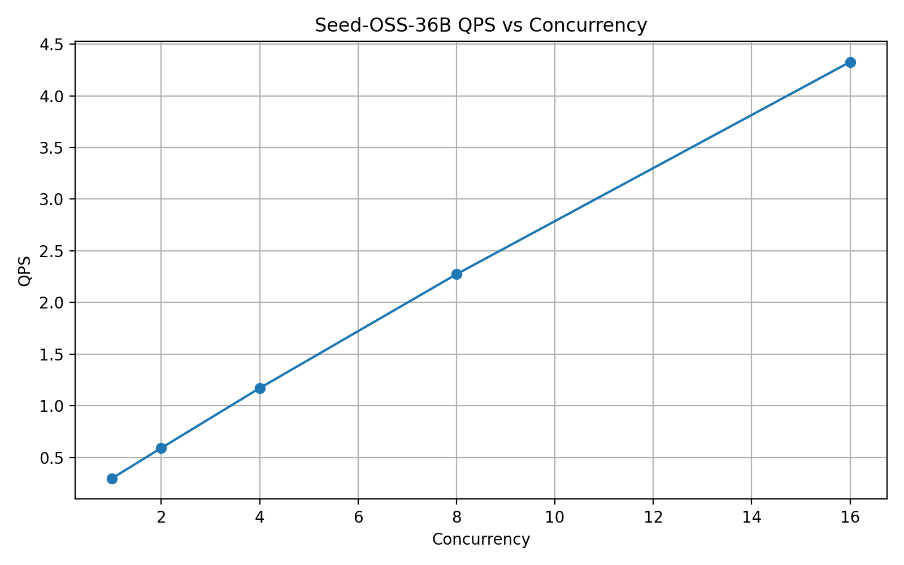
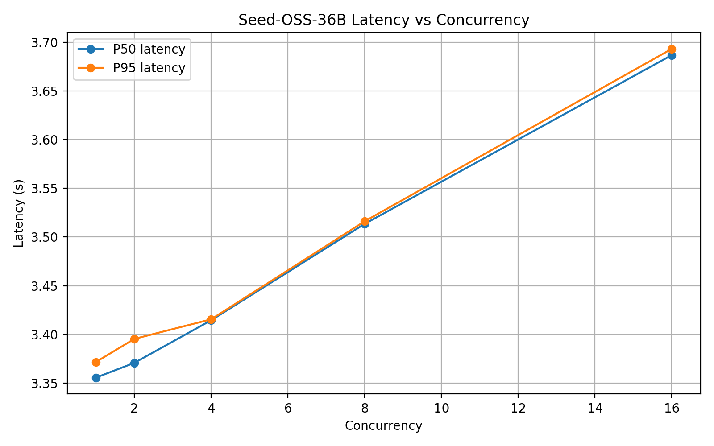
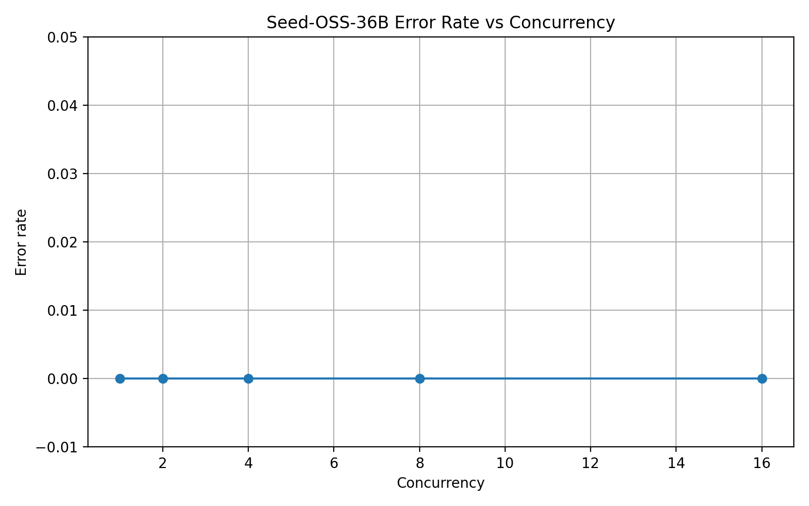
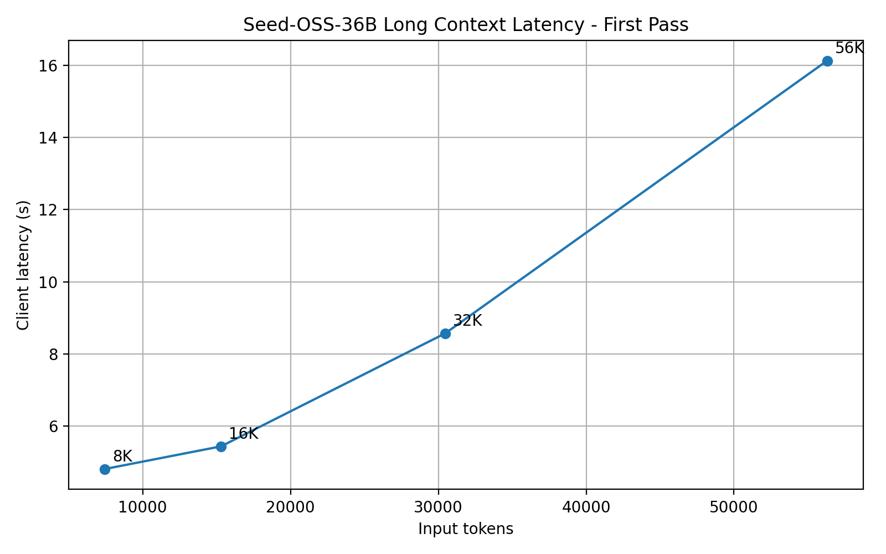
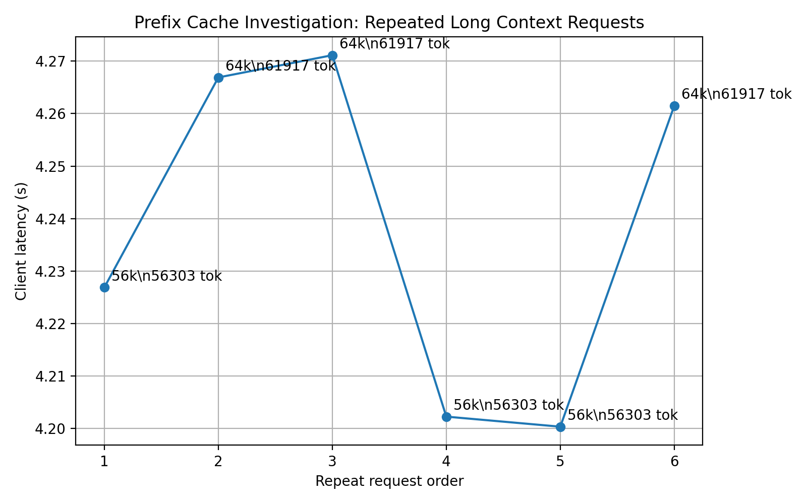
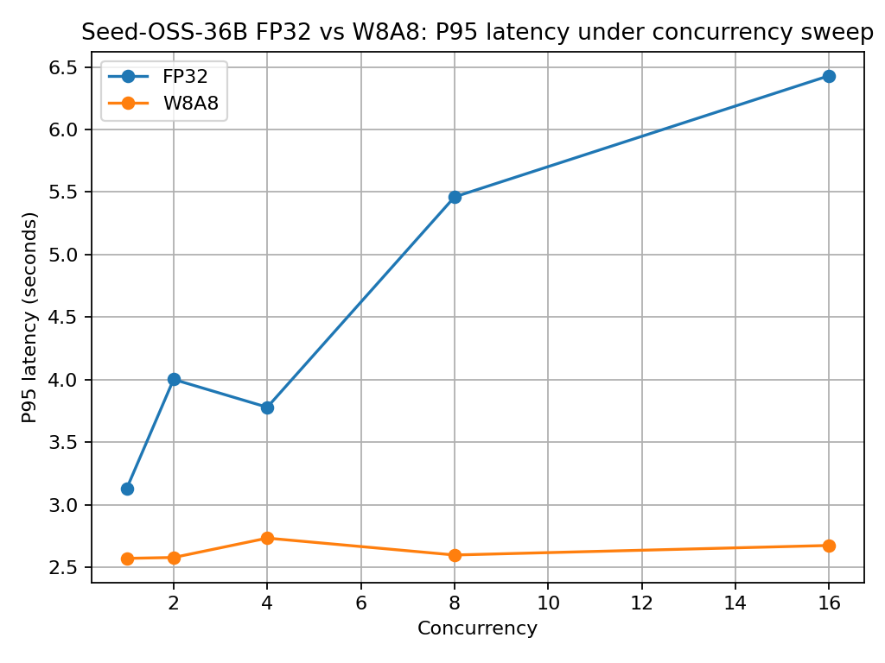
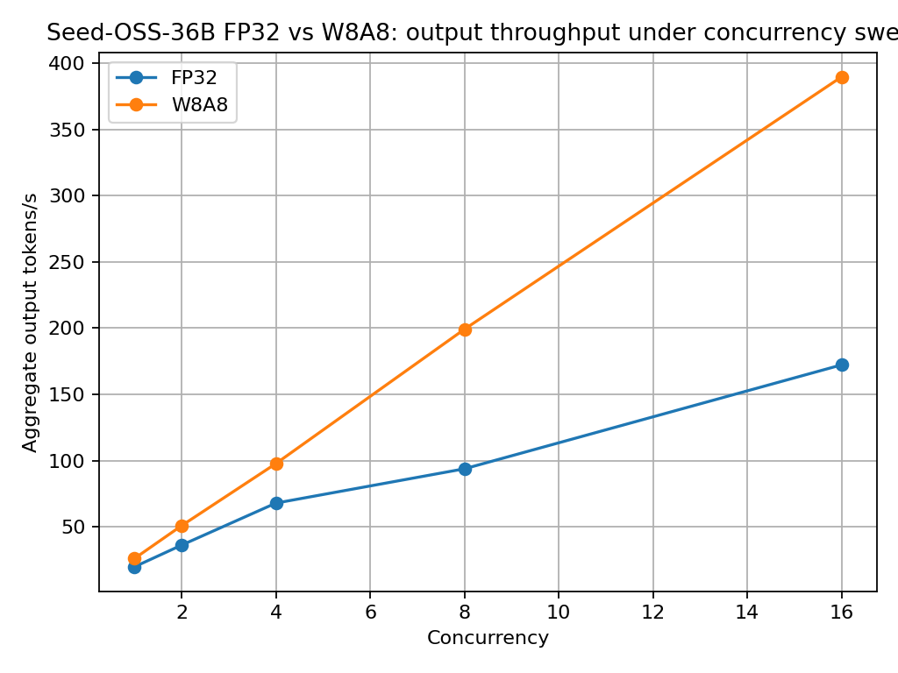

# 第 2 周性能优化报告：Seed-OSS-36B 推理服务性能分析与模型特性验证

## 1. 本周目标

第 2 周目标是在第 1 周已完成 Seed-OSS-36B-Instruct 基础部署、FastAPI 封装、vLLM 接入、Thinking Budget 参数链路和 Prometheus 基础监控的基础上，进一步推进推理服务的性能分析与优化验证。

本周重点从“服务跑通”升级为“性能可观测、瓶颈可分析、优化有数据支撑”。

核心工作包括：

1. 使用 Prometheus + Grafana 分析推理服务指标、GPU 使用情况和内存瓶颈；
2. 扩展并发性能测试，统计 QPS、P50/P95 latency、tokens/s 和 error_rate；
3. 做上下文长度梯度测试，分析 context length 对显存、KV Cache、延迟和吞吐的影响；
4. 评估 Seed-OSS-36B 量化优化路径，形成 BF16 baseline 与可落地量化方案的对比；
5. 结合 GQA 与 KV Cache 机制解释长上下文和高并发下的性能变化；
6. 补充 GSM8K 数学推理与代码生成场景验证；
7. 完成 FAQ、API 错误码和边界情况说明，提升服务可维护性。

---

## 2. Week1 基线回顾

第 1 周已完成以下基线能力：

| 项目 | 当前状态 |
|---|---|
| 模型 | ByteDance-Seed/Seed-OSS-36B-Instruct |
| 推理引擎 | vLLM 0.11.2 |
| API 层 | FastAPI |
| 后端适配 | VLLMBackend |
| GPU | 2×NVIDIA A100-SXM4-80GB |
| dtype | bfloat16 |
| Tensor Parallel | TP=2 |
| max_model_len | 4096 |
| max_num_batched_tokens | 8192 |
| FastAPI metrics | 已接入 |
| vLLM metrics | 已验证 |
| Thinking Budget | 512 / 1024 已验证 |
| 初步并发测试 | concurrency=2 / 4 |
| 稳定运行显存 | 约 75.8GB / 80GB per GPU |

Week1 结论：

1. Seed-OSS-36B-Instruct 已完成基础服务化部署；
2. FastAPI + VLLMBackend + vLLM Server 架构可用；
3. 当前 4K context 下 BF16 TP=2 配置可运行；
4. 显存压力已经较高，后续长上下文和更高并发必须逐步测试；
5. 512K full-context 不应直接硬冲，需要先做上下文长度梯度测试和资源边界分析。

---

## 3. Week2 交付范围

本周交付分为 7 类。

### 3.1 监控与可观测性

目标：

1. 配置 Prometheus scrape；
2. 搭建或记录 Grafana dashboard；
3. 展示 FastAPI、vLLM 和 GPU 相关指标；
4. 为本阶段性能瓶颈分析提供数据来源。

关注指标：

| 类型 | 指标 |
|---|---|
| FastAPI | request count, request latency, status code |
| vLLM | running requests, waiting requests, KV cache usage, prefix cache |
| GPU | memory used, utilization, memory utilization |
| Benchmark | QPS, P50, P95, tokens/s, error_rate |

本周新增监控采样脚本：

| 脚本 | 作用 | 产出 |
|---|---|---|
| [`scripts/sample_gpu_metrics.sh`](../scripts/sample_gpu_metrics.sh) | 使用 `nvidia-smi` 定时采样 GPU 显存、GPU utilization、memory utilization | [`logs/week2_nvidia_smi_sampling.csv`](../logs/week2_nvidia_smi_sampling.csv) |
| [`scripts/snapshot_vllm_metrics.py`](../scripts/snapshot_vllm_metrics.py) | 抓取 vLLM `/metrics` 中的 running requests、waiting requests、KV Cache usage、prefix cache 指标 | `results/week2_vllm_metrics_snapshot.txt` |

GPU 采样命令示例：

    bash scripts/sample_gpu_metrics.sh logs/week2_nvidia_smi_sampling.csv 5

vLLM metrics 快照命令示例：

    python scripts/snapshot_vllm_metrics.py \
      --url http://127.0.0.1:8002/metrics \
      --output results/week2_vllm_metrics_snapshot.txt

本周已保存 Prometheus 配置、Grafana dashboard JSON、Grafana live load probe 截图、vLLM metrics 快照和 `nvidia-smi` 采样文件，用于分析 GPU 利用率、显存瓶颈、KV Cache 压力、Prefix Cache 命中和请求排队行为。

---

### 3.2 并发 / Batch 性能测试

目标：

测试不同并发度下服务吞吐、尾延迟和稳定性变化。

实验配置：

| concurrency | max_new_tokens | thinking_budget | 说明 |
|---:|---:|---:|---|
| 1 | 128 | 512 | 单请求基线 |
| 2 | 128 | 512 | 小并发 |
| 4 | 128 | 512 | Week1 已验证，Week2 复测 |
| 8 | 128 | 512 | 中等并发 |
| 16 | 128 | 512 | 高阶尝试 |

记录指标：

1. total_requests；
2. successful_requests；
3. failed_requests；
4. error_rate；
5. QPS；
6. client_latency_avg；
7. client_latency_p50；
8. client_latency_p95；
9. tokens_per_second_avg；
10. GPU memory；
11. vLLM running/waiting requests；
12. KV cache usage。

已完成图表：

1. QPS vs concurrency；
2. P95 latency vs concurrency；
3. tokens/s vs concurrency；
4. error_rate vs concurrency；
5. GPU memory vs concurrency。

---

### 3.2.1 max_num_batched_tokens 专项调优

在基础并发测试之后，本项目进一步对 vLLM 的 `max_num_batched_tokens` 参数进行了专项调优分析。该参数会影响 vLLM 调度阶段可容纳的 token budget，从而影响 batch formation、请求等待、吞吐和尾延迟。

本轮实验覆盖 4096、8192、16384、32768 四组配置，并进一步区分 short-output burst 与 long-output decode-heavy 两类 workload。结果显示，`max_num_batched_tokens` 不存在对所有 workload 都最优的单一取值，应根据请求形态选择不同 serving profile。

| Workload | 对比配置 | 关键结果 | 工程结论 |
|---|---|---|---|
| short_output_c8 burst | 8192 vs 32768 | QPS 1.921 提升至 2.371；P95 latency 7.350s 降至 3.415s | 短输出 burst 场景更适合 32768 profile |
| long_output_c4 decode-heavy | 8192 vs 32768 | 8192 的 P95 latency 为 13.258s，32768 为 16.406s | 长输出或 mixed workload 更适合较保守的 8192 profile |

该实验说明，生产化 dynamic batching 不应简单理解为运行时热修改单个 vLLM engine 参数。由于 `max_num_batched_tokens` 属于启动时调度参数，更合理的工程设计是维护多个 serving profile，并在网关层根据 workload 类型进行路由。

专项报告路径：

- [`docs/week2_batch_token_tuning_report.md`](../docs/week2_batch_token_tuning_report.md)

相关 evidence：

- [`results/week2_batch_tokens_workload_summary_20260525.csv`](../results/week2_batch_tokens_workload_summary_20260525.csv)
- [`results/week2_batch_tokens_short_c8_wave_latency_summary_20260526.csv`](../results/week2_batch_tokens_short_c8_wave_latency_summary_20260526.csv)
- [`figures/week2/batch_tokens/week2_batch_tokens_profile_decision.png`](../figures/week2/batch_tokens/week2_batch_tokens_profile_decision.png)
- [`figures/week2/batch_tokens/week2_batch_tokens_workload_qps_summary.png`](../figures/week2/batch_tokens/week2_batch_tokens_workload_qps_summary.png)
- [`figures/week2/batch_tokens/week2_batch_tokens_workload_p95_summary.png`](../figures/week2/batch_tokens/week2_batch_tokens_workload_p95_summary.png)

### 3.3 上下文长度梯度测试

目标：

回应 Week1 中 max_model_len=4096 与 Seed-OSS 原生 512K 能力差距较大的问题，用分阶段实验分析长上下文下的显存、延迟、KV Cache 压力和稳定性边界。

本阶段已完成三组长上下文实验：

1. 64K serving profile 下的上下文长度梯度测试；
2. 128K serving profile 下的长上下文边界验证；
3. 4×A100、TP=4 下的 512K serving configuration 近极限验证。

64K 实验使用 `max_model_len=65536`，完成 8K、16K、32K、56K 和 61.9K input tokens 级别请求。首次梯度测试显示，随着输入 tokens 从 7,434 增长到 56,303，client latency 从 4.81s 增长到 16.13s，tokens/s 从 26.69 下降到 7.94，符合长上下文 prefill 成本上升预期。

128K 实验使用 `max_model_len=131072`、`max_num_seqs=1` 的边界 profile，完成 conservative、near-limit 和 over-limit 三类请求：

| Case | Input tokens | Status | Client latency (s) | 结论 |
|---|---:|---|---:|---|
| 128K conservative | 126,222 | 200 / success | 84.350549 | 成功处理接近 128K 的长上下文请求 |
| 128K near-limit | 130,608 | 200 / success | 10.089885 | 成功逼近 131,072 token 上限，但受 prefix cache / warm state 影响 |
| 128K over-limit | 134,991 | 400 / rejected | 0.191030 | 超过上下文上限后被 vLLM 明确拒绝，系统没有 OOM 或崩溃 |

后续补充验证已在 4×NVIDIA A100-SXM4-80GB、Tensor Parallel Size=4、`max_model_len=524288` 的配置下完成。BF16 KV 与 FP8 KV 两条 512K serving configuration 均成功启动，并分别完成约 500K prompt tokens 的真实 near-limit 请求：BF16 KV 的实际 `prompt_tokens=500033`、`total_tokens=500065`、HTTP 200、latency 为 533.85s；FP8 KV 的实际 `prompt_tokens=500037`、`total_tokens=500069`、HTTP 200、latency 为 770.60s。两条请求均未出现 OOM、RuntimeError 或进程退出。

该结果证明 512K serving configuration 的启动、长输入 prefill、KV Cache 分配和单请求完成状态已完成真机验证。由于 chat template 与 completion tokens 同样占用上下文窗口，本次使用约 500K prompt tokens，而非构造 524,288 个纯输入 tokens。该实验不构成多并发 512K 吞吐 benchmark。

FP8 KV 将 GPU KV Cache size 从 909,360 提升到 1,807,008 tokens，并将 vLLM 报告的 524,288-token request concurrency estimate 从 1.73x 提升到 3.45x，两项均约为 1.99 倍。本次单请求 near-limit 测试中，FP8 KV latency 高于 BF16 KV，因此其已验证收益是 KV Cache 容量与长上下文并发余量扩展，而不是单请求 latency 优化。

---

### 3.4 量化优化可行性与对比

原始目标要求：

    INT8 量化，对比 FP32 精度下的速度与显存占用。

本阶段已形成可复现的量化与 serving 证据，但不同路线的 checkpoint 来源、dtype、kernel、prompt renderer、runtime 和服务参数并不完全一致。因此，量化结果必须按 serving-stack 与评测协议分别解释，不能合并为单一“量化精度排行榜”。

| 路线 | 当前状态 | 已验证结论 | 边界 |
|---|---|---|---|
| BF16 / vLLM | 已完成 | 作为主 serving baseline，完成并发、长上下文与 GSM8K 评测 | 原始 GSM8K `@256` 受输出截断影响 |
| FP32 vs W8A8 | 已完成 | 完成实际部署组合下的 QPS、P95 latency、output tokens/s、model loading memory 与 KV Cache 对比 | 并非全参数严格单变量消融 |
| W8A8 compressed-tensors | 已完成 | 完成离线量化、vLLM serving、smoke、并发 sweep 与 GSM8K full evaluation | 当前稳定可复现的 8-bit 权重量化 serving 路线 |
| BnB INT8 | 已完成质量评测 | 完成 Transformers + BitsAndBytes `LLM.int8()` runtime 的 GSM8K `@256` 全量 1319 题评测，以及 348 个历史 cap-hit 样本的 `@768` 定向复测 | 不属于 vLLM TP=2 serving 性能闭环 |
| AWQ-Marlin | 已完成独立验证 | 完成 external pre-quantized artifact 的 FP16 + AWQ-Marlin serving-stack、API smoke 与 GSM8K full evaluation | 不纳入 BF16/W8A8 同源性能或纯量化质量排名 |
| strict INT8 / GPTQ | 未完成 | 未形成 artifact、稳定服务启动、API 与完整评测闭环 | 保留兼容性与失败边界 |
| FP8 KV Cache | 已完成边界验证 | 完成 4×A100 下 BF16 KV 与 FP8 KV 的 512K near-limit 容量与 headroom 对照 | 未形成统一 workload 下的完整性能收益评测 |

FP32 与 W8A8 的并发数据来自 2×NVIDIA A100-SXM4-80GB、vLLM 0.11.2、TP=2、`max_model_len=512`、`max_num_batched_tokens=512`、`max_num_seqs=1` 的服务配置。每个 concurrency=1/2/4/8/16 档位均执行 32 个请求；两侧 prompt 集合、completion token 分布和 HTTP 状态分布一致，但高并发档的记录顺序不同。

该对比同时包含 dtype、quantization backend 和 `gpu_memory_utilization` 差异：FP32 使用 float32、无量化 backend、`gpu_memory_utilization=0.98`；W8A8 使用 bfloat16、`compressed-tensors`、`gpu_memory_utilization=0.90`。因此，结果应表述为实际部署组合对比，不能将全部性能差异严格归因于量化位宽本身。

在该实际 serving envelope 中，W8A8 的 QPS 和 aggregate output tokens/s 提升约 31.4% 至 126.1%，P95 latency 降低约 17.9% 至 58.4%。model loading memory 从 67.5901 GiB 降至 17.7109 GiB，下降约 73.8%。vLLM 会将释放出的显存重新用于 KV Cache，因此该 73.8% 仅指 model loading memory，不等同于运行时 `nvidia-smi` 总显存按相同比例下降。

### 3.5 KV Cache 与 GQA 分析

目标：

结合 Week2 的并发和上下文长度实验，解释 GQA 和 KV Cache 如何影响 Seed-OSS-36B 的推理性能。

重点分析：

1. GQA 如何减少 key/value head 数量；
2. GQA 如何降低 KV Cache 显存压力；
3. 上下文长度增长时 KV Cache usage 如何变化；
4. concurrency 增加时 running/waiting requests 如何变化；
5. P95 latency 上升是否来自排队、prefill、decode 或显存压力。

---

### 3.6 GSM8K 数学推理验证

目标：

验证 Seed-OSS-36B-Instruct 在数学推理任务上的服务稳定性、结果正确性、输出预算边界与端到端运行表现。

已完成 BF16、W8A8、BnB INT8 与 AWQ 的 GSM8K 评测，但这些路线的 artifact、runtime、prompt rendering、dtype、kernel 与 output budget 不完全一致，因此不构成单一量化 accuracy 排名。

BF16 原始 full run 在 `max_new_tokens=256` 下完成 1319/1319 API 成功、999 题正确、accuracy 为 75.7392%。W8A8 原始 full run在相同输出预算下完成 1319/1319 API 成功、986 题正确、accuracy 为 74.7536%。这两组结果保留为固定短输出预算下的 route-level serving outcome；由于两条路线的 prompt rendering 不完全一致，且大量样本触及 256-token output cap，不能将其差异解释为纯量化质量回归。

cap-hit 定向复测进一步验证了输出截断影响：

| 路线 | 定向子集 | 输出上限 | 正确数 | Accuracy | 说明 |
|---|---:|---:|---:|---:|---|
| BF16 / vLLM | 366 | 768 | 333 | 90.9836% | 历史 BF16 `@256` cap-hit 子集 |
| W8A8 / vLLM | 395 | 768 | 353 | 89.3671% | 历史 W8A8 `@256` cap-hit 子集 |
| BnB INT8 / Transformers | 1319 | 256 | 1009 | 76.4973% | 完整 runtime INT8 评测，API 0 失败；348 个历史 cap-hit 样本另行 `@768` 复测为 316/348、90.8046%，无样本仍触顶 |

AWQ-Marlin 已完成独立 `@768` full evaluation：1319/1319 API 成功、1258 题正确、accuracy 为 95.3753%。该结果证明 external AWQ artifact 在 FP16 + AWQ-Marlin serving stack 下完成完整评测，但其 serving envelope 与 BF16/W8A8 不同，不进入纯量化 accuracy 排名。

### 3.7 代码生成验证

目标：

验证当前服务链路是否能够支持基础函数生成、代码提取与本地自动判题。

早期 5 题 mini eval 仅保留为 smoke evidence。后续已扩展为 50 个自定义 HumanEval/MBPP-style 轻量函数生成任务，并对每个生成结果执行本地 Python 单元测试。

初版 20 题全部返回 HTTP 200，但由于 prompt、generation budget 与代码提取逻辑不足，单元测试为 0/20；该结果不作为模型代码能力结论。修正版 20 题通过 10/20，平均 latency 为 7.19s；追加 30 题通过 16/30，平均 latency 为 8.54s。最终 50 题合计通过 26/50，pass rate 为 52.0%，加权平均 latency 约为 8.00s。

该实验说明服务、代码输出提取和基础自动判题链路可运行，但通过率有限。结果只能表述为轻量代码生成验证，不替代官方 HumanEval、MBPP 或 Seed-Coder 专项 benchmark，也不与公开榜单直接比较。

## 4. Week2 新增文档

为回应 Week1 反馈，本周新增：

1. [`docs/troubleshooting_faq.md`](../docs/troubleshooting_faq.md)
2. [`docs/api_error_codes.md`](../docs/api_error_codes.md)

这两份文档用于提升服务的可维护性和可排查性。

---

## 5. 实验结果索引

本节索引 Week2 已完成实验结果与对应 evidence 路径。

### 5.1 并发 benchmark

已完成文件：

    evidence/week2_64k_context/results/week2_concurrency_c1_summary.csv
    evidence/week2_64k_context/results/week2_concurrency_c2_summary.csv
    evidence/week2_64k_context/results/week2_concurrency_c4_summary.csv
    evidence/week2_64k_context/results/week2_concurrency_c8_summary.csv
    evidence/week2_64k_context/results/week2_concurrency_c16_summary.csv

### 5.2 上下文长度 benchmark

已完成文件：

    results/week2_context_gradient_summary.csv
    docs/week2_context_gradient_summary.md
    results/week2_context_length_8k_on_64k_service.csv
    results/week2_context_length_16k_on_64k_service.csv
    results/week2_context_length_32k_on_64k_service.csv
    results/week2_context_length_64k_conservative_on_64k_service.csv
    results/week2_context_length_64k_near_limit_on_64k_service.csv
    results/week2_context_repeat_r1_56k_then_64k.csv
    results/week2_context_repeat_r2_64k_then_56k.csv
    results/week2_context_repeat_r3_56k_then_64k.csv
    results/new_2xa100_seed_oss_128k_conservative_context_test_20260529.csv
    results/new_2xa100_seed_oss_128k_near_limit_context_test_20260529.csv
    results/new_2xa100_seed_oss_128k_over_limit_context_test_20260529.csv
    docs/week2/seed_oss_128k_context_boundary_review.md

### 5.3 量化可行性

已完成文件：

    results/new_2xa100_seed_oss_fp32_vs_w8a8_batchprofile_improvement_20260529.csv
    docs/week2_quantization_feasibility_report.md
    docs/week2_requirement_compliance_matrix.md

### 5.4 GSM8K

已完成文件：

    results/week2_gsm8k_full_seed_oss_budget0_summary.csv

### 5.5 代码生成

已完成文件：

    results/week2_codegen_mini_seed_oss_budget0.csv

### 5.6 图表

已完成图表：

    figures/week2/concurrency/week2_qps_vs_concurrency_report.png
    figures/week2/concurrency/week2_latency_p50_p95_vs_concurrency.png
    figures/week2/concurrency/week2_tokens_per_second_vs_concurrency_report.png
    figures/week2/concurrency/week2_error_rate_vs_concurrency_report.png
    figures/week2/context/week2_context_latency_first_pass_only.png
    figures/week2/context/week2_context_tokens_per_second_first_pass_only.png
    figures/week2/prefix_cache/week2_prefix_cache_repeat_latency.png
    figures/week2/quantization/seed_oss_fp32_vs_w8a8_qps.png
    figures/week2/quantization/seed_oss_fp32_vs_w8a8_p95_latency.png
    figures/week2/quantization/seed_oss_fp32_vs_w8a8_output_tokens_per_second.png

---

## 6. Seed-OSS-36B 长上下文性能验证（RunPod 2×A100 80GB）

### 6.1 实验环境

本轮长上下文实验在 RunPod 云端 GPU 环境完成，核心配置如下：

| Item | Value |
|---|---|
| GPU | 2 × NVIDIA A100-SXM4-80GB |
| Serving engine | vLLM 0.11.2 |
| Model | ByteDance-Seed/Seed-OSS-36B-Instruct |
| Precision | BF16 |
| Tensor parallel size | 2 |
| max_model_len | 65536 |
| FastAPI backend | VLLMBackend |
| Thinking Budget | 512 |

vLLM 启动日志显示：

- `Using max model len 65536`
- `GPU KV cache size: 290,448 tokens`
- `Maximum concurrency for 65,536 tokens per request: 4.43x`
- FastAPI `/health`、vLLM `/v1/models`、vLLM `/metrics` 均验证成功。

### 6.2 长上下文梯度测试结果

| Context | Input tokens | Output tokens | Client latency (s) | Server latency (s) | Tokens/s | Status | Note |
|---|---:|---:|---:|---:|---:|---|---|
| 8K | 7434 | 128 | 4.811523 | 4.796601 | 26.6856 | 200 / True | first-pass |
| 16K | 15297 | 128 | 5.439229 | 5.435553 | 23.5487 | 200 / True | first-pass |
| 32K | 30465 | 128 | 8.570771 | 8.566287 | 14.9423 | 200 / True | first-pass |
| 56K | 56303 | 128 | 16.128279 | 16.122442 | 7.9392 | 200 / True | first-pass / cold-ish |
| 61.9K | 61917 | 128 | 7.437081 | 7.432070 | 17.2227 | 200 / True | near-limit, cache-affected |

### 6.3 结果分析

8K、16K、32K、56K 的首次测试结果显示，随着输入 token 数从 7,434 增长到 56,303，client latency 从 4.81s 增长到 16.13s，tokens/s 从 26.69 下降到 7.94。这符合长上下文推理中 prefill 成本上升的预期。

但 61.9K near-limit 测试出现了低于 56K 的 latency，不能直接解释为上下文越长性能越好。后续交替复测显示，56K 与 61.9K 在重复请求后 latency 均稳定在约 4.2s 左右，结合 vLLM `prefix_cache_hits_total` 与 `prefix_cache_queries_total` 的变化，可以判断该现象主要来自 prefix cache、warm state 和重复 prompt 结构。

因此，本报告将长上下文结果分为两类解释：

1. 首次梯度测试：用于观察上下文长度增长对 latency 和 tokens/s 的影响。
2. 重复长文档测试：用于验证 vLLM prefix cache 对重复前缀场景的加速效果。

### 6.4 Prefix Cache 复测结论

复测前后 vLLM metrics 显示，prefix cache 查询与命中量显著增长。重复测试期间 prefix cache 命中率较高，说明相似长文本请求会明显受缓存状态影响。

这对生产推理服务有直接意义：

- 对重复系统 prompt、重复合同模板、重复知识库前缀的场景，prefix cache 可以降低重复 prefill 成本。
- 对完全不同的长文档请求，不能用缓存命中后的 latency 代表冷启动长上下文性能。
- 长上下文 benchmark 必须区分 cold prompt、warm prompt、prefix-cache-hit prompt，否则结果会被误读。

### 6.5 Evidence 文件索引

本节实验对应的原始证据已归档到 GitHub 仓库，主要文件如下：

| Evidence | Path |
|---|---|
| 64K vLLM 启动日志 | [`evidence/week2_64k_context/logs/week2_seed_oss_vllm_launch_64k.log`](../evidence/week2_64k_context/logs/week2_seed_oss_vllm_launch_64k.log) |
| 64K vLLM 启动关键行 | [`evidence/week2_64k_context/logs/week2_seed_oss_vllm_64k_key_startup_lines.txt`](../evidence/week2_64k_context/logs/week2_seed_oss_vllm_64k_key_startup_lines.txt) |
| FastAPI 64K 日志 | [`evidence/week2_64k_context/logs/week2_fastapi_vllm_64k.log`](../evidence/week2_64k_context/logs/week2_fastapi_vllm_64k.log) |
| 8K context result | [`evidence/week2_64k_context/results/week2_context_length_8k_on_64k_service.csv`](../evidence/week2_64k_context/results/week2_context_length_8k_on_64k_service.csv) |
| 16K context result | [`evidence/week2_64k_context/results/week2_context_length_16k_on_64k_service.csv`](../evidence/week2_64k_context/results/week2_context_length_16k_on_64k_service.csv) |
| 32K context result | [`evidence/week2_64k_context/results/week2_context_length_32k_on_64k_service.csv`](../evidence/week2_64k_context/results/week2_context_length_32k_on_64k_service.csv) |
| 56K context result | [`evidence/week2_64k_context/results/week2_context_length_64k_conservative_on_64k_service.csv`](../evidence/week2_64k_context/results/week2_context_length_64k_conservative_on_64k_service.csv) |
| 61.9K near-limit result | [`evidence/week2_64k_context/results/week2_context_length_64k_near_limit_on_64k_service.csv`](../evidence/week2_64k_context/results/week2_context_length_64k_near_limit_on_64k_service.csv) |
| Prefix cache repeat round 1 | [`evidence/week2_64k_context/results/week2_context_repeat_r1_56k_then_64k.csv`](../evidence/week2_64k_context/results/week2_context_repeat_r1_56k_then_64k.csv) |
| Prefix cache repeat round 2 | [`evidence/week2_64k_context/results/week2_context_repeat_r2_64k_then_56k.csv`](../evidence/week2_64k_context/results/week2_context_repeat_r2_64k_then_56k.csv) |
| Prefix cache repeat round 3 | [`evidence/week2_64k_context/results/week2_context_repeat_r3_56k_then_64k.csv`](../evidence/week2_64k_context/results/week2_context_repeat_r3_56k_then_64k.csv) |
| Prefix cache before metrics | [`evidence/week2_64k_context/results/week2_vllm_metrics_before_context_repeat_investigation.txt`](../evidence/week2_64k_context/results/week2_vllm_metrics_before_context_repeat_investigation.txt) |
| Prefix cache after metrics | [`evidence/week2_64k_context/results/week2_vllm_metrics_after_context_repeat_investigation.txt`](../evidence/week2_64k_context/results/week2_vllm_metrics_after_context_repeat_investigation.txt) |
| GPU sampling log | [`evidence/week2_64k_context/logs/week2_nvidia_smi_sampling_64k_context.csv`](../evidence/week2_64k_context/logs/week2_nvidia_smi_sampling_64k_context.csv) |
| 原始压缩证据包 | [`artifacts/week2_64k_context_evidence_20260514_005638.tar.gz`](../artifacts/week2_64k_context_evidence_20260514_005638.tar.gz) |

### 6.6 报告图表索引

本节实验图表已保存到 [`figures/`](../figures) 目录。图表使用原则如下：

- 并发性能图使用 1/2/4/8/16 concurrency 的真实 FastAPI + vLLM benchmark summary。
- 长上下文趋势图只使用 first-pass/cold-ish 数据点：8K、16K、32K、56K。
- 61.9K near-limit 结果受到 prefix cache 与 warm state 影响，不并入 cold-ish 趋势图，而单独通过 prefix cache repeat 图解释。

| Figure | Path | Purpose |
|---|---|---|
| QPS vs concurrency | [`figures/week2/concurrency/week2_qps_vs_concurrency_report.png`](../figures/week2/concurrency/week2_qps_vs_concurrency_report.png) | 展示 concurrency 提升带来的吞吐提升 |
| P50/P95 latency vs concurrency | [`figures/week2/concurrency/week2_latency_p50_p95_vs_concurrency.png`](../figures/week2/concurrency/week2_latency_p50_p95_vs_concurrency.png) | 展示并发增加下的尾延迟变化 |
| Tokens/s vs concurrency | [`figures/week2/concurrency/week2_tokens_per_second_vs_concurrency_report.png`](../figures/week2/concurrency/week2_tokens_per_second_vs_concurrency_report.png) | 展示单请求生成速率随并发变化的 trade-off |
| Error rate vs concurrency | [`figures/week2/concurrency/week2_error_rate_vs_concurrency_report.png`](../figures/week2/concurrency/week2_error_rate_vs_concurrency_report.png) | 展示并发测试下 error rate 保持 0 |
| Long-context latency first-pass | [`figures/week2/context/week2_context_latency_first_pass_only.png`](../figures/week2/context/week2_context_latency_first_pass_only.png) | 展示 8K/16K/32K/56K 首次长上下文 latency 趋势 |
| Long-context tokens/s first-pass | [`figures/week2/context/week2_context_tokens_per_second_first_pass_only.png`](../figures/week2/context/week2_context_tokens_per_second_first_pass_only.png) | 展示首次长上下文 tokens/s 下降趋势 |
| Prefix cache repeat latency | [`figures/week2/prefix_cache/week2_prefix_cache_repeat_latency.png`](../figures/week2/prefix_cache/week2_prefix_cache_repeat_latency.png) | 展示重复长文本请求在 prefix cache/warm state 下的 latency 变化 |
| FP32 vs W8A8 QPS | [`figures/week2/quantization/seed_oss_fp32_vs_w8a8_qps.png`](../figures/week2/quantization/seed_oss_fp32_vs_w8a8_qps.png) | 展示 W8A8 量化 serving 相比 FP32 baseline 的吞吐提升 |
| FP32 vs W8A8 P95 latency | [`figures/week2/quantization/seed_oss_fp32_vs_w8a8_p95_latency.png`](../figures/week2/quantization/seed_oss_fp32_vs_w8a8_p95_latency.png) | 展示 W8A8 量化 serving 对尾延迟的改善 |
| FP32 vs W8A8 output tokens/s | [`figures/week2/quantization/seed_oss_fp32_vs_w8a8_output_tokens_per_second.png`](../figures/week2/quantization/seed_oss_fp32_vs_w8a8_output_tokens_per_second.png) | 展示量化前后生成吞吐变化 |

### 6.7 关键图表

#### 并发吞吐与延迟

#### 长上下文首次梯度测试

#### Prefix Cache 复测

## 7. FP32 vs W8A8 量化性能对比

本阶段完成了 FP32 baseline 与 W8A8 compressed-tensors 的实际 serving-stack 对比。两侧均使用 2×NVIDIA A100-SXM4-80GB、vLLM 0.11.2、TP=2、`max_model_len=512`、`max_num_batched_tokens=512`、`max_num_seqs=1`。

每个 concurrency=1/2/4/8/16 档位均执行 32 个请求。两份原始 CSV 的 prompt 集合、completion token 分布和 HTTP 状态分布一致，且所有请求均成功；在 concurrency=4/8/16 下，CSV 记录顺序不同，反映并发请求的完成或写入顺序不同。因此，本节结果是相同请求集合下的部署组合对比，而不是逐请求顺序完全受控的微基准测试。

| Concurrency | FP32 QPS | W8A8 QPS | QPS 提升 | FP32 P95 latency | W8A8 P95 latency | P95 降低 |
|---:|---:|---:|---:|---:|---:|---:|
| 1 | 0.3117 | 0.4096 | 31.41% | 3.1300s | 2.5703s | 17.88% |
| 2 | 0.5674 | 0.7968 | 40.43% | 4.0014s | 2.5774s | 35.59% |
| 4 | 1.0626 | 1.5286 | 43.85% | 3.7787s | 2.7323s | 27.69% |
| 8 | 1.4671 | 3.1125 | 112.15% | 5.4604s | 2.5973s | 52.43% |
| 16 | 2.6922 | 6.0876 | 126.12% | 6.4298s | 2.6735s | 58.42% |

W8A8 在该实际 serving envelope 中呈现更高 QPS、更高 aggregate output tokens/s 与更低 P95 latency。FP32 使用 float32、无量化 backend、`gpu_memory_utilization=0.98`；W8A8 使用 bfloat16、`compressed-tensors`、`gpu_memory_utilization=0.90`。因此，这些差异不能全部归因于量化位宽，而应解释为完整部署组合的观测结果。

显存方面，FP32 的 model loading memory 为 67.5901 GiB，W8A8 为 17.7109 GiB，下降约 73.8%。available KV cache memory 从 9.43 GiB 增至 53.04 GiB，GPU KV cache size 从 38,624 tokens 增至 434,480 tokens。由于 vLLM 会将权重释放空间重新用于 KV Cache，运行时 `nvidia-smi` 总显存不能作为该 73.8% 的同比口径。

## 8. 当前风险与处理策略

| 风险或边界 | 当前状态 | 处理原则 |
|---|---|---|
| strict INT8 / GPTQ 未形成稳定 serving | 未完成 | 保留 artifact、后端兼容性与失败证据；不纳入主 serving 结论 |
| AWQ 与 BF16/W8A8 的运行组合不同 | 已验证但不可直接合并排名 | 保留 AWQ-Marlin full evaluation；不将 accuracy 差异归因于量化位宽 |
| FP32/W8A8 服务参数并非完全一致 | 已明确 | 以实际 deployment-stack 对比表述，不包装为严格单变量消融 |
| 512K 多并发性能 | 未完成 | 当前仅完成单请求 near-limit、容量与 headroom 验证 |
| 官方代码 benchmark / Seed-Coder 对照 | 未完成 | 50 题结果仅作为轻量函数生成验证 |
| Grafana 长期留存 | 未完成生产级验证 | 已保存配置、dashboard、metrics snapshots 和 live-load evidence |

## 9. 阶段结论

本阶段完成了 Seed-OSS-36B-Instruct 的真实 GPU 推理性能分析、量化 serving、长上下文边界验证、GSM8K 质量诊断、代码生成轻量验证与可观测性证据归档。所有结果均限定在对应硬件、vLLM 版本、模型 artifact、服务参数和评测协议下。

1. 并发与 batch-token 调优方面，vLLM continuous batching 在固定短输出 workload 下实现了吞吐提升，并确认 `max_num_batched_tokens` 不存在适用于所有 workload 的单一最优取值：short-output burst 与 long-output decode-heavy workload 需要不同 serving profile。

2. 长上下文方面，2×A100 环境完成 64K 梯度、128K 边界与 Prefix Cache 行为验证；后续在 4×A100、TP=4、`max_model_len=524288` 下完成 BF16 KV 与 FP8 KV 的 512K serving configuration 真机 near-limit 验证。FP8 KV 将 KV Cache 容量与 512K request concurrency estimate 均提升约 1.99 倍，但本次单请求 latency 高于 BF16 KV，因此不表述为 latency 优化。

3. 性能与量化方面，FP32 与 W8A8 的实际 deployment-stack 对比显示，在已记录的请求集合、并发档位和服务配置下，W8A8 的 QPS 与 aggregate output tokens/s 提升约 31.4% 至 126.1%，P95 latency 降低约 17.9% 至 58.4%。该结果包含 dtype、quantization backend 与 `gpu_memory_utilization` 差异，不能将全部收益严格归因于量化位宽。model loading memory 从 67.5901 GiB 降至 17.7109 GiB，下降约 73.8%；运行时总显存不使用该比例表述。

4. GSM8K 方面，BF16/W8A8 原始 `@256` full run 保留为固定短输出预算下的 route-level serving outcome。cap-hit `@768` 定向复测证明大量历史错误受输出截断影响。AWQ-Marlin 已完成独立 `@768` full evaluation；compressed-tensors strict INT8 的 vLLM serving 性能闭环与 GPTQ 尚未形成稳定闭环；BnB INT8 runtime 的完整 GSM8K 质量评测已完成。

5. 代码生成方面，服务验证从早期 5 题 smoke 扩展至 50 个自定义 HumanEval/MBPP-style 轻量函数任务，最终 26/50 通过本地单元测试，pass rate 为 52.0%。该结果证明基础服务、代码提取与自动判题链路可运行，但不构成官方 HumanEval、MBPP 或 Seed-Coder 专项能力结论。

6. 可观测性与证据链方面，仓库已保留 FastAPI metrics、vLLM `/metrics`、Prometheus 配置、Grafana dashboard、GPU sampling、启动日志、benchmark CSV、JSON summary 与图表。当前系统瓶颈应从模型权重、KV Cache 容量、长上下文 prefill 和 workload profile 的整体权衡理解，而不能仅以单次 GPU utilization 判断。

综上，本阶段已形成可复现的推理 serving 与性能优化证据链；未完成边界明确为 compressed-tensors strict INT8 stable vLLM serving、GPTQ、512K 多并发性能评测、官方代码 benchmark 与 Seed-Coder 对照；BnB INT8 runtime 质量评测不属于未完成项。
