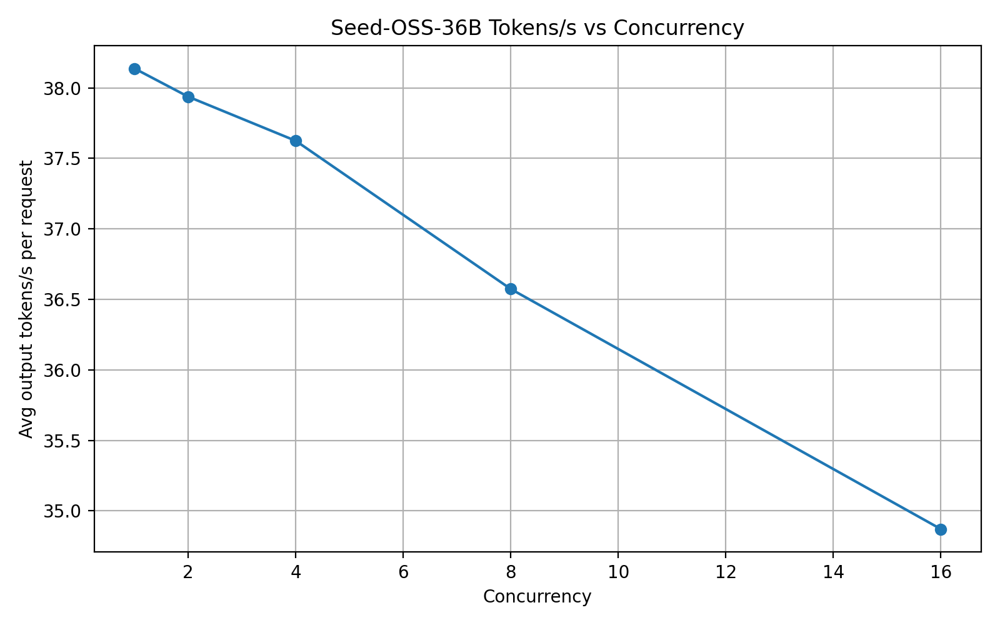
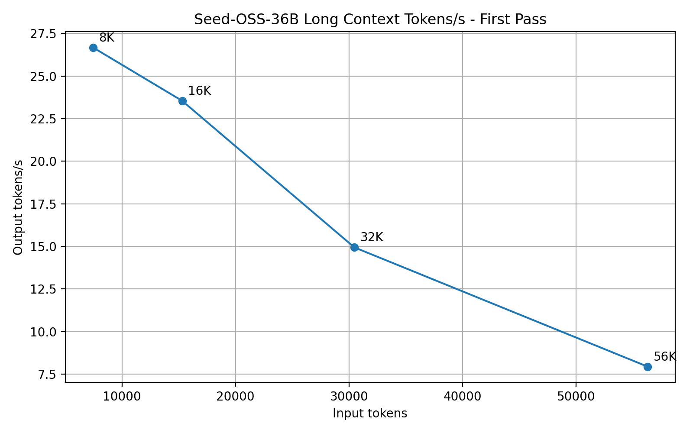

# 第 2 周性能优化报告：Seed-OSS-36B 推理服务性能分析与模型特性验证

## 1. 本周目标

第 2 周目标是在第 1 周已完成 Seed-OSS-36B-Instruct 基础部署、FastAPI 封装、vLLM 接入、Thinking Budget 参数链路和 Prometheus 基础监控的基础上，进一步推进推理服务的性能分析与优化验证。

本周重点从“服务跑通”升级为“性能可观测、瓶颈可分析、优化有数据支撑”。

核心工作包括：

1. 使用 Prometheus + Grafana 分析推理服务指标、GPU 使用情况和内存瓶颈；
2. 扩展并发性能测试，统计 QPS、P50/P95 latency、tokens/s 和 error_rate；
3. 做上下文长度梯度测试，分析 context length 对显存、KV Cache、延迟和吞吐的影响；
4. 评估 Seed-OSS-36B 量化优化路径，形成 BF16 baseline 与可落地量化方案的对比；
5. 结合 GQA 与 KV Cache 机制解释长上下文和高并发下的性能变化；
6. 补充 GSM8K 数学推理与代码生成场景验证；
7. 完成 FAQ、API 错误码和边界情况说明，提升服务可维护性。

---

## 2. Week1 基线回顾

第 1 周已完成以下基线能力：

| 项目 | 当前状态 |
|---|---|
| 模型 | ByteDance-Seed/Seed-OSS-36B-Instruct |
| 推理引擎 | vLLM 0.11.2 |
| API 层 | FastAPI |
| 后端适配 | VLLMBackend |
| GPU | 2×NVIDIA A100-SXM4-80GB |
| dtype | bfloat16 |
| Tensor Parallel | TP=2 |
| max_model_len | 4096 |
| max_num_batched_tokens | 8192 |
| FastAPI metrics | 已接入 |
| vLLM metrics | 已验证 |
| Thinking Budget | 512 / 1024 已验证 |
| 初步并发测试 | concurrency=2 / 4 |
| 稳定运行显存 | 约 75.8GB / 80GB per GPU |

Week1 结论：

1. Seed-OSS-36B-Instruct 已完成基础服务化部署；
2. FastAPI + VLLMBackend + vLLM Server 架构可用；
3. 当前 4K context 下 BF16 TP=2 配置可运行；
4. 显存压力已经较高，后续长上下文和更高并发必须逐步测试；
5. 512K full-context 不应直接硬冲，需要先做上下文长度梯度测试和资源边界分析。

---

## 3. Week2 交付范围

本周交付分为 7 类。

### 3.1 监控与可观测性

目标：

1. 配置 Prometheus scrape；
2. 搭建或记录 Grafana dashboard；
3. 展示 FastAPI、vLLM 和 GPU 相关指标；
4. 为后续性能瓶颈分析提供数据来源。

关注指标：

| 类型 | 指标 |
|---|---|
| FastAPI | request count, request latency, status code |
| vLLM | running requests, waiting requests, KV cache usage, prefix cache |
| GPU | memory used, utilization, memory utilization |
| Benchmark | QPS, P50, P95, tokens/s, error_rate |

本周新增监控采样脚本：

| 脚本 | 作用 | 产出 |
|---|---|---|
| `scripts/sample_gpu_metrics.sh` | 使用 `nvidia-smi` 定时采样 GPU 显存、GPU utilization、memory utilization | `logs/week2_nvidia_smi_sampling.csv` |
| `scripts/snapshot_vllm_metrics.py` | 抓取 vLLM `/metrics` 中的 running requests、waiting requests、KV Cache usage、prefix cache 指标 | `results/week2_vllm_metrics_snapshot.txt` |

GPU 采样命令示例：

    bash scripts/sample_gpu_metrics.sh logs/week2_nvidia_smi_sampling.csv 5

vLLM metrics 快照命令示例：

    python scripts/snapshot_vllm_metrics.py \
      --url http://127.0.0.1:8002/metrics \
      --output results/week2_vllm_metrics_snapshot.txt

如果 Grafana dashboard 暂未完整启动，本周先使用 Prometheus metrics 快照、vLLM metrics 快照和 `nvidia-smi` 离线采样文件作为监控证据，并在后续报告中结合 CSV 和图表分析 GPU 利用率、显存瓶颈、KV Cache 压力和请求排队情况。

---

### 3.2 并发 / Batch 性能测试

目标：

测试不同并发度下服务吞吐、尾延迟和稳定性变化。

计划测试矩阵：

| concurrency | max_new_tokens | thinking_budget | 说明 |
|---:|---:|---:|---|
| 1 | 128 | 512 | 单请求基线 |
| 2 | 128 | 512 | 小并发 |
| 4 | 128 | 512 | Week1 已验证，Week2 复测 |
| 8 | 128 | 512 | 中等并发 |
| 16 | 128 | 512 | 高阶尝试 |

记录指标：

1. total_requests；
2. successful_requests；
3. failed_requests；
4. error_rate；
5. QPS；
6. client_latency_avg；
7. client_latency_p50；
8. client_latency_p95；
9. tokens_per_second_avg；
10. GPU memory；
11. vLLM running/waiting requests；
12. KV cache usage。

预期图表：

1. QPS vs concurrency；
2. P95 latency vs concurrency；
3. tokens/s vs concurrency；
4. error_rate vs concurrency；
5. GPU memory vs concurrency。

---

### 3.3 上下文长度梯度测试

目标：

回应 Week1 中 max_model_len=4096 与 Seed-OSS 原生 512K 能力差距较大的问题，用分阶段实验分析长上下文下的显存、延迟和稳定性边界。

计划测试矩阵：

| context length | 目标 |
|---:|---|
| 4K | Week1 基线复测 |
| 8K | 低风险扩展 |
| 16K | 中等长度扩展 |
| 32K | 高阶尝试 |
| 64K | 资源允许时尝试 |

记录指标：

1. input_tokens；
2. output_tokens；
3. max_model_len；
4. latency；
5. P50 / P95；
6. tokens/s；
7. GPU memory；
8. KV cache usage；
9. error_rate；
10. 是否 OOM；
11. 是否 timeout。

说明：

512K full-context 是 Seed-OSS 的目标能力，但直接进行 512K 测试会带来显著显存、prefill latency 和 OOM 风险。本周优先采用 4K/8K/16K/32K 梯度测试，用数据推导资源边界和后续 512K 专项测试所需条件。

---

### 3.4 量化优化可行性与对比

任务书要求：

    INT8 量化，对比 FP32 精度下的速度与显存占用。

当前资源边界：

Week1 实测中，Seed-OSS-36B-Instruct 在 BF16、TP=2、max_model_len=4096 下，2×A100 80GB 稳定运行时每张卡显存约 75.8GB/80GB。FP32 权重显存理论上约为 BF16 的 2 倍，因此 FP32 serving baseline 在当前资源下可能需要更多 GPU 或调整实验方案。

本周实际方案：

1. 以 BF16 作为实际 serving baseline；
2. 调研 vLLM 对 Seed-OSS-36B 的 INT8 / FP8 / AWQ / GPTQ 支持情况；
3. 若可落地，则运行量化版本并对比显存、P95、tokens/s；
4. 若不可落地，则保留兼容性分析、失败日志和替代方案；
5. 输出量化可行性对比表。

量化对比表结构：

| 方案 | 是否完成 | 当前结论 | 备注 |
|---|---|---|---|
| BF16 baseline | 已完成 | 已完成真实部署、长上下文、并发、GSM8K full 和 codegen mini eval | 当前主基线 |
| FP32 serving | 未完成 | 当前 2×A100 80GB 环境显存风险高 | 作为后续资源可行性测试 |
| INT8 / AWQ / GPTQ | 未完成 | 缺少已验证兼容量化权重和 vLLM loading path | 后续量化实验方向 |
| FP8 KV Cache | 未完成 | 与长上下文 KV cache 显存优化强相关 | 后续优先级较高 |

---

### 3.5 KV Cache 与 GQA 分析

目标：

结合 Week2 的并发和上下文长度实验，解释 GQA 和 KV Cache 如何影响 Seed-OSS-36B 的推理性能。

重点分析：

1. GQA 如何减少 key/value head 数量；
2. GQA 如何降低 KV Cache 显存压力；
3. 上下文长度增长时 KV Cache usage 如何变化；
4. concurrency 增加时 running/waiting requests 如何变化；
5. P95 latency 上升是否来自排队、prefill、decode 或显存压力。

---

### 3.6 GSM8K 数学推理验证

目标：

验证 Seed-OSS-36B 在数学推理任务上的基本能力，并记录推理服务指标。

计划：

1. 选取 GSM8K 小样本；
2. 记录 prompt、response、latency、output_tokens；
3. 人工判断是否正确；
4. 汇总 accuracy、平均 latency 和错误类型。

本轮已完成 GSM8K full benchmark。最终结果为 1319 个样本全部 API 成功，正确 999 个，accuracy 为 75.74%，P50 latency 为 5.51s，P95 latency 为 6.69s。

---

### 3.7 代码生成验证

目标：

验证 Seed 模型在代码生成场景中的基础表现，为后续 Seed-Coder 或代码助手场景做准备。

计划：

1. 准备 5-10 个代码生成 prompt；
2. 覆盖 Python 函数、数据处理、API 调用、错误修复等场景；
3. 记录 latency、output_tokens、是否可运行；
4. 总结常见错误类型。

本轮已完成 5 个 Python 代码生成 mini eval，全部 API 成功，并全部通过简单正确性检查。该测试用于轻量验证当前服务链路支持代码生成场景。

---

## 4. Week2 新增文档

为回应 Week1 反馈，本周新增：

1. `docs/troubleshooting_faq.md`
2. `docs/api_error_codes.md`

这两份文档用于提升服务的可维护性和可排查性。

---

## 5. 实验结果索引

本节索引 Week2 已完成实验结果与对应 evidence 路径。

### 5.1 并发 benchmark

计划文件：

    results/week2_concurrency_benchmark.csv
    results/week2_concurrency_summary.csv

### 5.2 上下文长度 benchmark

计划文件：

    results/week2_context_length_benchmark.csv
    results/week2_context_length_summary.csv

### 5.3 量化可行性

计划文件：

    results/week2_quantization_comparison.csv
    docs/week2_quantization_notes.md

### 5.4 GSM8K

计划文件：

    results/week2_gsm8k_full_seed_oss_budget0_summary.csv

### 5.5 代码生成

计划文件：

    results/week2_codegen_mini_seed_oss_budget0.csv

### 5.6 图表

已完成图表：

    figures/week2_qps_vs_concurrency_report.png
    figures/week2_latency_p50_p95_vs_concurrency.png
    figures/week2_tokens_per_second_vs_concurrency_report.png
    figures/week2_error_rate_vs_concurrency_report.png
    figures/week2_context_latency_first_pass_only.png
    figures/week2_context_tokens_per_second_first_pass_only.png
    figures/week2_prefix_cache_repeat_latency.png

---

## 6. Seed-OSS-36B 长上下文性能验证（RunPod 2×A100 80GB）

### 6.1 实验环境

本轮长上下文实验在 RunPod 云端 GPU 环境完成，核心配置如下：

| Item | Value |
|---|---|
| GPU | 2 × NVIDIA A100-SXM4-80GB |
| Serving engine | vLLM 0.11.2 |
| Model | ByteDance-Seed/Seed-OSS-36B-Instruct |
| Precision | BF16 |
| Tensor parallel size | 2 |
| max_model_len | 65536 |
| FastAPI backend | VLLMBackend |
| Thinking Budget | 512 |

vLLM 启动日志显示：

- `Using max model len 65536`
- `GPU KV cache size: 290,448 tokens`
- `Maximum concurrency for 65,536 tokens per request: 4.43x`
- FastAPI `/health`、vLLM `/v1/models`、vLLM `/metrics` 均验证成功。

### 6.2 长上下文梯度测试结果

| Context | Input tokens | Output tokens | Client latency (s) | Server latency (s) | Tokens/s | Status | Note |
|---|---:|---:|---:|---:|---:|---|---|
| 8K | 7434 | 128 | 4.811523 | 4.796601 | 26.6856 | 200 / True | first-pass |
| 16K | 15297 | 128 | 5.439229 | 5.435553 | 23.5487 | 200 / True | first-pass |
| 32K | 30465 | 128 | 8.570771 | 8.566287 | 14.9423 | 200 / True | first-pass |
| 56K | 56303 | 128 | 16.128279 | 16.122442 | 7.9392 | 200 / True | first-pass / cold-ish |
| 61.9K | 61917 | 128 | 7.437081 | 7.432070 | 17.2227 | 200 / True | near-limit, cache-affected |

### 6.3 结果分析

8K、16K、32K、56K 的首次测试结果显示，随着输入 token 数从 7,434 增长到 56,303，client latency 从 4.81s 增长到 16.13s，tokens/s 从 26.69 下降到 7.94。这符合长上下文推理中 prefill 成本上升的预期。

但 61.9K near-limit 测试出现了低于 56K 的 latency，不能直接解释为上下文越长性能越好。后续交替复测显示，56K 与 61.9K 在重复请求后 latency 均稳定在约 4.2s 左右，结合 vLLM `prefix_cache_hits_total` 与 `prefix_cache_queries_total` 的变化，可以判断该现象主要来自 prefix cache、warm state 和重复 prompt 结构。

因此，本报告将长上下文结果分为两类解释：

1. 首次梯度测试：用于观察上下文长度增长对 latency 和 tokens/s 的影响。
2. 重复长文档测试：用于验证 vLLM prefix cache 对重复前缀场景的加速效果。

### 6.4 Prefix Cache 复测结论

复测前后 vLLM metrics 显示，prefix cache 查询与命中量显著增长。重复测试期间 prefix cache 命中率较高，说明相似长文本请求会明显受缓存状态影响。

这对生产推理服务有直接意义：

- 对重复系统 prompt、重复合同模板、重复知识库前缀的场景，prefix cache 可以降低重复 prefill 成本。
- 对完全不同的长文档请求，不能用缓存命中后的 latency 代表冷启动长上下文性能。
- 长上下文 benchmark 必须区分 cold prompt、warm prompt、prefix-cache-hit prompt，否则结果会被误读。

### 6.5 Evidence 文件索引

本节实验对应的原始证据已归档到 GitHub 仓库，主要文件如下：

| Evidence | Path |
|---|---|
| 64K vLLM 启动日志 | `evidence/week2_64k_context/logs/week2_seed_oss_vllm_launch_64k.log` |
| 64K vLLM 启动关键行 | `evidence/week2_64k_context/logs/week2_seed_oss_vllm_64k_key_startup_lines.txt` |
| FastAPI 64K 日志 | `evidence/week2_64k_context/logs/week2_fastapi_vllm_64k.log` |
| 8K context result | `evidence/week2_64k_context/results/week2_context_length_8k_on_64k_service.csv` |
| 16K context result | `evidence/week2_64k_context/results/week2_context_length_16k_on_64k_service.csv` |
| 32K context result | `evidence/week2_64k_context/results/week2_context_length_32k_on_64k_service.csv` |
| 56K context result | `evidence/week2_64k_context/results/week2_context_length_64k_conservative_on_64k_service.csv` |
| 61.9K near-limit result | `evidence/week2_64k_context/results/week2_context_length_64k_near_limit_on_64k_service.csv` |
| Prefix cache repeat round 1 | `evidence/week2_64k_context/results/week2_context_repeat_r1_56k_then_64k.csv` |
| Prefix cache repeat round 2 | `evidence/week2_64k_context/results/week2_context_repeat_r2_64k_then_56k.csv` |
| Prefix cache repeat round 3 | `evidence/week2_64k_context/results/week2_context_repeat_r3_56k_then_64k.csv` |
| Prefix cache before metrics | `evidence/week2_64k_context/results/week2_vllm_metrics_before_context_repeat_investigation.txt` |
| Prefix cache after metrics | `evidence/week2_64k_context/results/week2_vllm_metrics_after_context_repeat_investigation.txt` |
| GPU sampling log | `evidence/week2_64k_context/logs/week2_nvidia_smi_sampling_64k_context.csv` |
| 原始压缩证据包 | `artifacts/week2_64k_context_evidence_20260514_005638.tar.gz` |

### 6.6 报告图表索引

本节实验图表已保存到 `figures/` 目录。图表使用原则如下：

- 并发性能图使用 1/2/4/8/16 concurrency 的真实 FastAPI + vLLM benchmark summary。
- 长上下文趋势图只使用 first-pass/cold-ish 数据点：8K、16K、32K、56K。
- 61.9K near-limit 结果受到 prefix cache 与 warm state 影响，不并入 cold-ish 趋势图，而单独通过 prefix cache repeat 图解释。

| Figure | Path | Purpose |
|---|---|---|
| QPS vs concurrency | `figures/week2_qps_vs_concurrency_report.png` | 展示 concurrency 提升带来的吞吐提升 |
| P50/P95 latency vs concurrency | `figures/week2_latency_p50_p95_vs_concurrency.png` | 展示并发增加下的尾延迟变化 |
| Tokens/s vs concurrency | `figures/week2_tokens_per_second_vs_concurrency_report.png` | 展示单请求生成速率随并发变化的 trade-off |
| Error rate vs concurrency | `figures/week2_error_rate_vs_concurrency_report.png` | 展示并发测试下 error rate 保持 0 |
| Long-context latency first-pass | `figures/week2_context_latency_first_pass_only.png` | 展示 8K/16K/32K/56K 首次长上下文 latency 趋势 |
| Long-context tokens/s first-pass | `figures/week2_context_tokens_per_second_first_pass_only.png` | 展示首次长上下文 tokens/s 下降趋势 |
| Prefix cache repeat latency | `figures/week2_prefix_cache_repeat_latency.png` | 展示重复长文本请求在 prefix cache/warm state 下的 latency 变化 |

### 6.7 关键图表

#### 并发吞吐与延迟

#### 长上下文首次梯度测试

#### Prefix Cache 复测

## 7. 当前风险与处理策略

| 风险 | 影响 | 处理策略 |
|---|---|---|
| FP32 baseline 显存过高 | 无法按字面完成 FP32 vs INT8 | 使用 BF16 serving baseline，并说明 FP32 资源需求 |
| INT8 路径不兼容 | 量化实验无法直接跑通 | 记录兼容性和失败日志，改用可支持方案 |
| 32K/64K OOM | 长上下文实验失败 | 保留 OOM 边界，降低 context length |
| 高并发 timeout | benchmark 失败率上升 | 保留失败样本，降低 concurrency 或增加 timeout |
| Grafana 配置耗时 | 影响主实验 | 先完成 Prometheus + dashboard notes，再补 JSON |
| GPU 成本过高 | 试错成本增加 | 先本地准备脚本和报告框架，再集中跑 GPU |

---

## 8. 阶段结论

本周完成了 Seed-OSS-36B-Instruct 推理服务在真实云端 GPU 环境下的性能优化与模型特性验证。系统采用 FastAPI + VLLMBackend + vLLM Server 三层架构，模型侧使用 vLLM 0.11.2、BF16、Tensor Parallel Size = 2，在 2 × NVIDIA A100-SXM4-80GB 上完成部署和验证。

核心实验结论如下：

1. 并发能力方面，在固定 128 output tokens 的条件下，concurrency 从 1 提升到 16 时，系统 QPS 从 0.325 提升到 3.848，吞吐提升约 11.84×；P95 latency 从 3.348s 上升到 3.532s，增幅约 5.5%；error rate 保持 0。结果说明 vLLM continuous batching 能有效提升吞吐，但会带来可控的单请求延迟与单请求 tokens/s 下降。

2. 长上下文能力方面，Seed-OSS-36B-Instruct 在 `max_model_len=65536` 配置下成功完成 8K、16K、32K、56K 以及 61.9K input tokens 级别的推理请求。首次梯度测试中，输入 tokens 从 7,434 增长到 56,303 时，client latency 从 4.81s 增长到 16.13s，tokens/s 从 26.69 下降到 7.94，符合长上下文 prefill 成本上升预期。

3. Prefix Cache 分析方面，61.9K near-limit 请求出现低于 56K 的 latency。通过交替复测和 vLLM metrics 分析，该现象主要来自 prefix cache、warm state 和重复 prompt 结构影响，不能解释为纯冷启动长上下文性能。该问题已在报告中单独建模并保留原始证据。

4. 监控与证据链方面，本周保存了 FastAPI health/metrics、vLLM `/metrics`、vLLM 启动日志、nvidia-smi 采样、benchmark CSV、图表和 evidence 压缩包。所有关键证据已归档到 `evidence/`、`artifacts/`、`results/` 和 `figures/` 目录，并提交到 GitHub。

5. 工程局限方面，当前实验完成的是 BF16 baseline、并发测试、KV cache/prefix cache 分析、64K 级别长上下文验证、GSM8K full benchmark 和代码生成 mini eval。INT8 量化、FP32 对比、512K full-context 和 Seed-Coder 专项测试仍需要更多 GPU 资源、兼容量化权重或独立实验窗口支持。GSM8K full benchmark 和代码生成 mini eval 已在本轮补充完成。当前报告中对这些项目以可行性分析和后续计划形式记录，避免伪造不可复现实验结果。

综上，Week2 已从简单 API 验证推进到真实大模型推理服务性能分析阶段，形成了可复现的部署脚本、测试脚本、原始实验数据、图表和工程解释。该阶段结果可作为后续 Week3 高可用架构、降级策略、多模态接入和 Week4 压测验收的基础。

