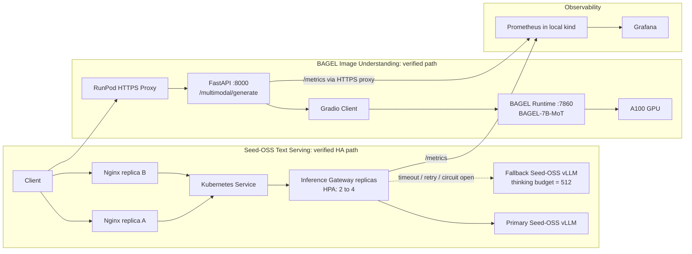

# Week3 高可用与多模态服务架构

## 架构范围

本阶段包含两条已验证的数据路径：

1. Seed-OSS 文本推理高可用路径；
2. BAGEL 图像理解路径。

两条路径共享项目级监控体系，但当前不是同一个统一网关服务。

## Seed-OSS 文本推理路径

客户端请求先进入 Nginx 负载均衡层，再经 Kubernetes Service 分发到 inference-gateway 副本。Gateway 通过主后端与 fallback 后端提供文本生成服务。

Gateway 的韧性参数如下：

- 主后端超时：8 秒；
- fallback 后端超时：8 秒；
- 有界重试：1 次；
- 重试退避：0.2 秒；
- 熔断失败阈值：2；
- 熔断恢复窗口：20 秒；
- fallback thinking budget：512。

HPA 以 Gateway Deployment 为目标，最小副本数为 2，最大副本数为 4，CPU 平均利用率目标为 50%。已完成 2 到 4 再回落到 2 的验证。

Nginx 不承担 upstream retry；`proxy_next_upstream off` 明确将超时重试、熔断和 fallback 决策留在 Gateway 层，避免两层重试造成重复请求。

## BAGEL 图像理解路径

BAGEL 服务运行在 RunPod A100 Pod 中。公网请求经过 RunPod HTTPS Proxy 到达 FastAPI 服务的 8000 端口；FastAPI 接收 multipart 图像和 prompt 后，通过本地 Gradio Client 调用 BAGEL Runtime 的 7860 端口。

已验证接口：

- `GET /multimodal/health`
- `POST /multimodal/generate`
- `GET /metrics`

图像理解 API 使用 ByteDance-Seed/BAGEL-7B-MoT。当前实际接入范围为图像理解，不包含图像生成、图像编辑、多轮多模态 agent、BAGEL 多副本高可用或统一 Nginx 路由。

## 观测路径

Gateway 与 BAGEL FastAPI 都暴露 Prometheus 指标。

- Gateway 指标由本地 kind Prometheus 通过 Kubernetes Pod Discovery 抓取；
- BAGEL 指标由本地 kind Prometheus 通过 HTTPS static target 抓取 RunPod proxy；
- Grafana 从 Prometheus 查询服务状态、请求、错误、延迟、GPU 显存和 GPU 利用率。

BAGEL Dashboard 覆盖：

- Target Up；
- Successful Requests；
- Recorded Errors；
- Error Rate；
- Request Rate；
- P50/P95 Gateway-to-BAGEL latency；
- GPU memory；
- GPU utilization。

## 当前边界

- Seed-OSS HA 路径与 BAGEL 路径当前为独立数据平面；
- BAGEL 当前是单 Pod、单 Runtime，不具备多副本 HA；
- BAGEL 公网 API 当前无认证和限流，不应表述为生产级公网服务；
- Grafana 中的 BAGEL 请求累计值是 FastAPI 进程启动后的 Counter，三案例审计样本数以审计 JSON/CSV 为准。

## 架构图

